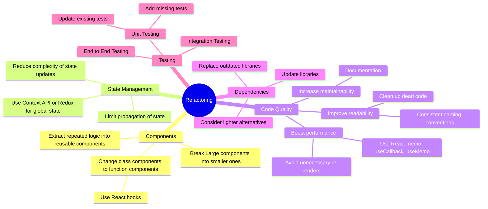

**ChatGPT** (https://chat.openai.com/) only supports simple Markdown language for formatting.


Sometimes, using a mindmap can help us better understand ideas. That's why I decided to give it a try.


## 1. Select the mindmap syntax to be used
---

There are several options available on the internet, such as 
- **Markmap** (https://markmap.js.org/) 
- **Mermaid.js** (https://mermaid.js.org/)

In this case, I'm using Mermaid.js because it supports other types of diagrams, like flowcharts.
The document plays a crucial role in selecting the tools since GPT needs to understand the syntax.

## 2. Teach GPT to understand the selected syntax
---

Mermaid.js has well-documented syntax guidelines available at https://mermaid.js.org/syntax/mindmap.html.
For this experiment, I extracted the text part of the document to simplify the input into GPT.
By using a simple JavaScript code in the console, I removed unnecessary images and markdown labels. 
Then, I copied the remaining text as part of the prompt instruction.

```js
// remove all the demo image
document.querySelectorAll('[role="graphics-document document"]').forEach(node => node.remove())
// remove the code markdown label
document.querySelectorAll('span.lang').forEach(node => node.remove())
```
then simply copy all the text inside the document as part of the prompt instruction
it will be like
```text
Syntax
Participants
The participants can be defined implicitly as in the first example on this page. The participants or actors are rendered in order of appearance in the diagram source text. Sometimes you might want to show the participants in a different order than how they appear in the first message. It is possible to specify the actor's order of appearance by doing the following:

Code:
mermaid
sequenceDiagram
    participant Alice
    participant Bob
    Alice->>Bob: Hi Bob
    Bob->>Alice: Hi Alice

Actors
If you specifically want to use the actor symbol instead of a rectangle with text you can do so by using actor statements as per below.

Code:
mermaid
sequenceDiagram
    actor Alice
    actor Bob
...

```

## 3. Create a prompt for GPT.
---
Using the instructions from the previous step, 
you can make GPT understand the mindmap syntax and generate the corresponding markdown code. Here's an example prompt:

```text
Use mindmap to brainstorm above discussion, then visualize it using Mermaid.js syntax (refer to the document below) 

... [insert the extracted text from the Mermaid.js mindmap syntax document]
```

## 4. Demo
---

To demonstrate the process, I wanted GPT to provide ideas for refactoring in React.
I used the [Prompt Creator](https://benqqqq.github.io/gpt-tools/prompt-list) tool to create a prompt as a React expert. 
Next, I combined this prompt with the one created in the previous step:

```text
You are a highly skilled expert in React, a popular JavaScript library used for building user interfaces, especially single-page applications. Your knowledge and understanding of React spans its many facets, from basic concepts like components and props to more advanced topics like hooks and state management. Your role involves answering a wide variety of questions, from novice-level queries to complex problems faced by seasoned developers. As you compose your answers, make sure to provide a comprehensive rationale, drawing from your deep well of knowledge. Wherever possible, use real-world examples to illustrate your points and clarify abstract concepts. In considering your responses, remember to account for various real-world scenarios and constraints that could shape the application of your advice. Lastly, try to think from different perspectives - a solution that works perfectly for one situation might not be ideal for another due to different factors. Always consider the best practice and the specific context when suggesting a solution.

Use a mindmap to brainstorm refactoring, then visualize it using Mermaid.js syntax (refer to the document below)

Mermaid Js Mindmap Document
...
```

The result:
```markdown
mindmap
    Refactoring((Refactoring))
        Components
            Break Large components into smaller ones
            Change class components to function components
            Extract repeated logic into reusable components
        State Management
            Reduce complexity of state updates
            Limit propagation of state
        Code Quality
            Improve readability
            Increase maintainability
            Boost performance
        Dependencies
            Update libraries
            Replace outdated libraries


```
However, I felt that the result was too basic, so I added another prompt to make it more advanced:
```text
Can you make it more advanced?
```
This generated the following markdown code:

```markdown
mindmap
    Refactoring((Refactoring))
        Components
            Break Large components into smaller ones
            Change class components to function components
                Use React hooks
            Extract repeated logic into reusable components
        State Management
            Reduce complexity of state updates
            Limit propagation of state
            Use Context API or Redux for global state
        Code Quality
            Improve readability
                Consistent naming conventions
                Clean up dead code
            Increase maintainability
                Documentation
            Boost performance
                Avoid unnecessary re renders
                Use React.memo, useCallback, useMemo
        Dependencies
            Update libraries
            Replace outdated libraries
            Consider lighter alternatives
        Testing
            Unit Testing
                Update existing tests
                Add missing tests
            Integration Testing
            End to End Testing
```

And this is how it looks like (https://mermaid.live/)

